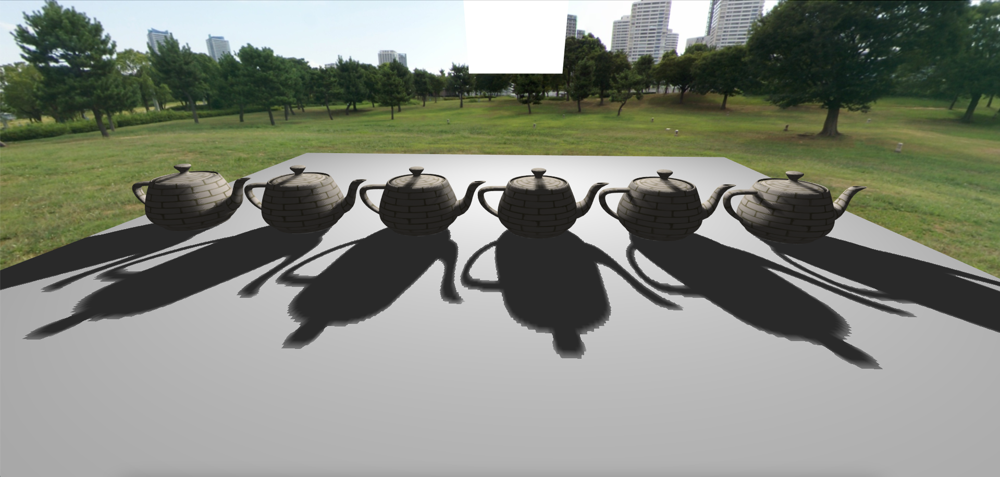
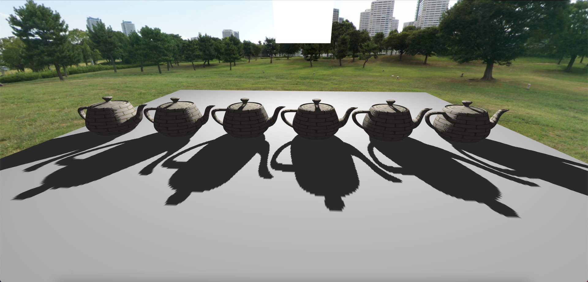
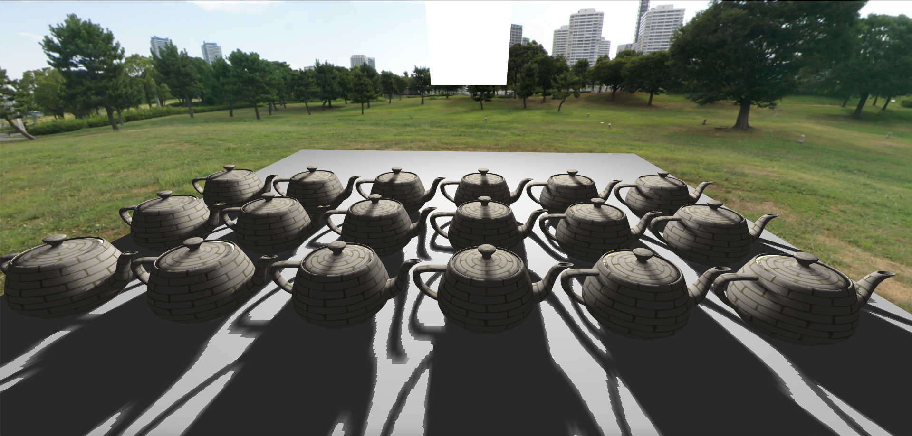
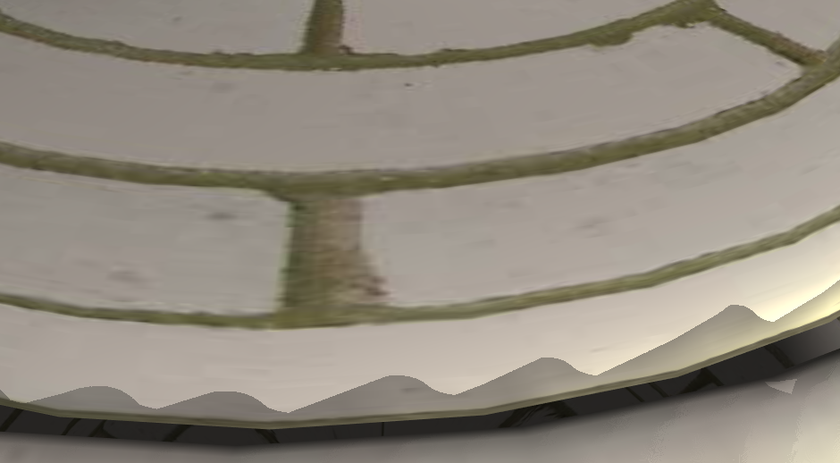
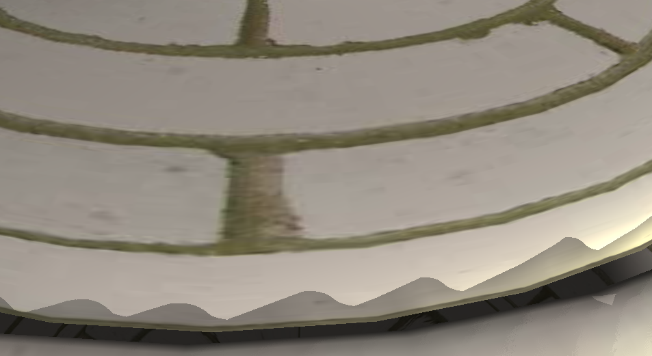
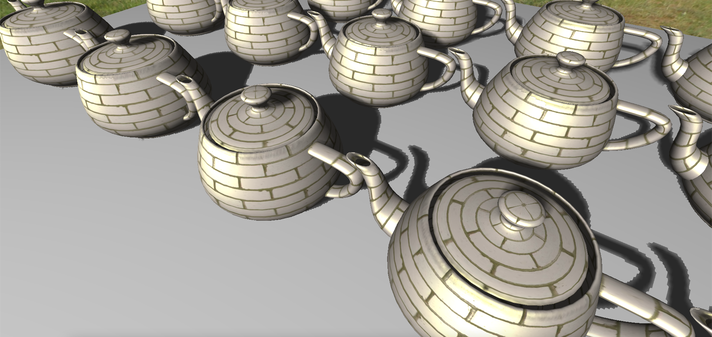
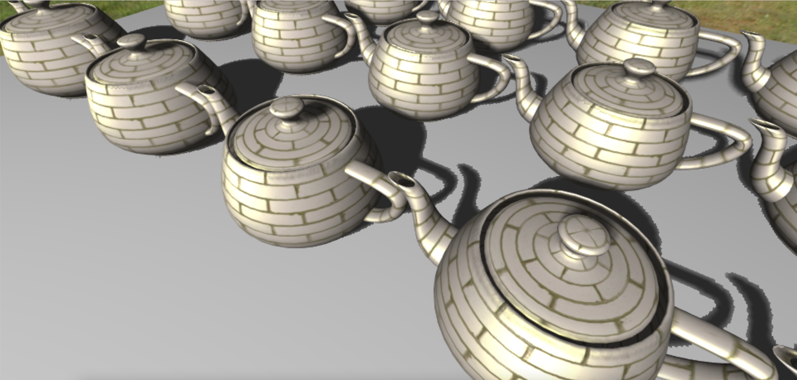
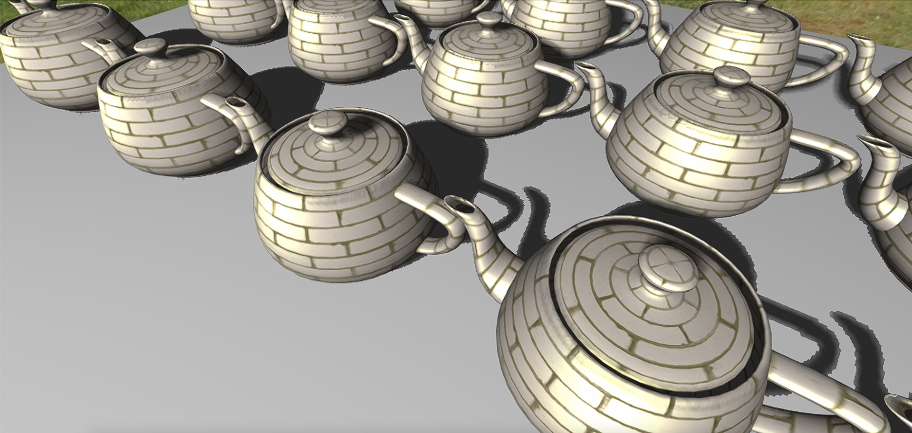

Individual Project: Akhil Balaji

Project Title: Percentage-Closer Soft Shadows with Spatial Upscaling

Implementation

1. Percentage Closer Soft Shadows

I've implemented Nvidia Percentage-Closer Soft Shadows(PCSS) from a simulated area light. The main components of the PCSS implementation are

  1. Blocker Search

The Blocker Search step uses the shadow map as a 2D depth texture to search for blockers in a randomly-spaced circle around the sample. The positions in the circle are chosen based on Poisson disk sampling and use Weighted Sample Elimination to generate Poisson samples to search for blockers. The number of blockers and average blocker depth determines the soft shadows applied to the sample.

  1. Percentage Closer Filtering(PCF)

The PCF step creates the soft-shadow penumbra by sampling the shadow texture in a neighborhood and then averaging across the sample count. The neighborhood around is sampled using the Poisson samples in a radius of discrete texel intervals. This is done to prevent repeat depth comparisons with the same texels in the depth comparison texture.

Sampler States

The Blocker Search and Percentage Closer Filtering both use the same shadow map. The Blocker Search operation uses the shadow map as a 2D depth texture to read depth values. In contrast, the Percentage Closer Filtering operation changes the sampler state of the shadow map to a depth comparison texture. The depth comparison texture sampler allows for linear interpolating with nearby texels while performing a depth comparison.

Slope-based bias

Using the shadow map on its own resulted in anomalies like shadow acne and peter-panning. The slope-based bias uses the angle between the light source relative to the sample position and the normal at the sample in world space. The depth value of the sample position is biased using the generated value before the shadow map lookup to prevent the mentioned issues.

Interactivity

1. The soft-shadows can be toggled on/off using the P key.
2. The camera position can be changed using the mouse.
3. Similarly, the light position can be changed by using the control key and the mouse.
4. The Anti-Aliasing can be toggled on/off using the M key
5. The Up/Down keys can be used to change the amount of softness of the plane shadow

_Figure 1 Teapots casting PCSS from a simulated area light_

_Figure 2 Teapots casting hard shadows using Shadow Mapping_

1. Instanced Rendering

I implemented Instanced Rendering of objects to render multiple objects in a single draw call.

The objects are drawn using glDrawArraysInstanced and the number of objects are passed as a parameter. The CPU calculates the per-object transformations and passes them as uniform mat4 arrays to the shader program. The shader decides which transformations to use based on the gl\_InstanceID of the shader invocation.

Interactivity

The number of objects placed on the plane can be changed using the left and right arrow keys. All drawn objects are used when generating the shadow map texture. The minimum number of objects is 1 and the maximum number is 18.

At 18 rendered objects, my Macbook cannot maintain 60 FPS and starts to struggle. This is a scenario wherein I hope to benefit the most from FSR.

_Figure 3 Instanced rendering of object with soft-shadows cast by all instances_

1. Spatial Upscaling using AMD FidelityFx SuperResolution

The application can be GPU heavy when drawing many shadow-casting objects. It can benefit performance by rendering at a lower resolution and then upscaling to the native resolution of the OpenGL window.

I integrated AMD FidelityFx SuperResolution into my project to improve performance using spatial upscaling from a lower render resolution framebuffer to the OpenGL windows resolution.

Implementation

1. Applying MSAA x8 anti-aliasing on framebuffer

The lower render resolution framebuffer needs to be properly anti-aliased before upscaling the image using FSR. This was done using a GL\_TEXTURE\_2D\_MULTISAMPLE texture as storage and the multiple sample color/depth render buffer components attached to multi-sample framebuffer. The multiple-sample texture, color and depth render buffers were set to a lower render resolution than the window resolution. The scene was then drawn to the multi-sample framebuffer.

1. Blit MSAA framebuffer to framebuffer with 2D texture

The MSAA framebuffer was blitted to a render buffer of the same size to be used in the FSR Upscaling Pass.

1. FSR Upscale Pass using Edge Adaptive Spatial Upscaling in Fragment Shader

The low render resolution is then upscaled using FSR. A screen-sized quad was generated using a vertex shader to generate samples for the window-sized framebuffer. The low resolution framebuffer texture is then sampled by the EASU algorithm to generate the upscaled framebuffer.

1. FSR Sharpening Pass using Robust Contrast Adaptive Sharpening in Fragment Shader

The Upscaled framebuffer is then sharpened using a similar Vertex-Fragment shader pipeline. The sharpened frame is rendered to the back buffer which is then displayed.

Features

1. Bilinear Upscaling

The application also supports bilinear upscaling of the lower render resolution framebuffer. This is used to provide comparisons to FSR.

1. Negative mipmap bias for object texture

The objects drawn to the lower render resolution framebuffer use a negative mipmap bias in order to use higher texture mipmap levels.

Interactivity

1. The MSAA anti-aliasing on the window size framebuffer can be toggled using the M key.
2. The scene can be rendered to a lower resolution framebuffer using the SPACE key.
3. The type of upscaling can be toggled between BILINEAR and FSR using the F key
4. The render resolution scale can be set using the 1,2,3,4 keys. 1 = 77% resolution scale, 2=67% resolution scale, 3=59% resolution scale, 4=50% resolution scale
5. The sharpening can be toggled using the S key
6. The level of sharpening can be changed using the 5,6,7,8 keys. 5 = Highest sharpening and 8 = lowest sharpening

_Figure 4 Anti-aliased frame with MSAA x8 at window resolution_

_Figure 5 Aliased frame at window resolution_

_Figure 6 Anti-aliased Scene rendered at window resolution(1080p)_

_Figure 7 Anti-aliased Scene rendered at 50% window resolution(1080p) and upscaled using bilinear upscaling_

_Figure 8 Anti-aliased Scene rendered at 50% window resolution(1080p) and upscaled using FSR upscaling_

How to use your implementation

1. Compile the PCSS.cpp file, cyCodeBase must be present in the include path

clang++ -std=c++11 -stdlib=libc++ PCSS.cpp lodepng.cpp -o PCSS.app -lglfw -lglew -framework OpenGL -I/Users/u1316087/Downloads/homebrew/include/ -L/Users/u1316087/Downloads/homebrew/lib

1. Run the executable

./PCSS.app teapot2.obj

What operating system and compiler you used
 Operating System: macOS 11.3 Big Sur

GLFW version: 3.3.6 GLEW version: 2.2.0\_1

Compiler:
 Apple clang version 12.0.5 (clang-1205.0.22.11) Target: x86\_64-apple-darwin20.4.0

External libraries and additional requirements to compile the project.

cyCodeBase, AMD FSR header, GLFW and GLEW are required

References

1. [https://developer.download.nvidia.com/shaderlibrary/docs/shadow\_PCSS.pdf](https://developer.download.nvidia.com/shaderlibrary/docs/shadow_PCSS.pdf)
2. [https://developer.download.nvidia.com/whitepapers/2008/PCSS\_Integration.pdf](https://developer.download.nvidia.com/whitepapers/2008/PCSS_Integration.pdf)
3. [https://github.com/GPUOpen-Effects/FidelityFX-FSR/raw/master/docs/FidelityFX-FSR-Overview-Integration.pdf](https://github.com/GPUOpen-Effects/FidelityFX-FSR/raw/master/docs/FidelityFX-FSR-Overview-Integration.pdf)
